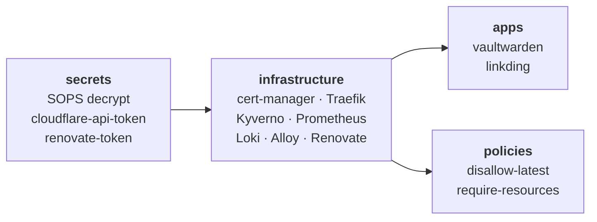
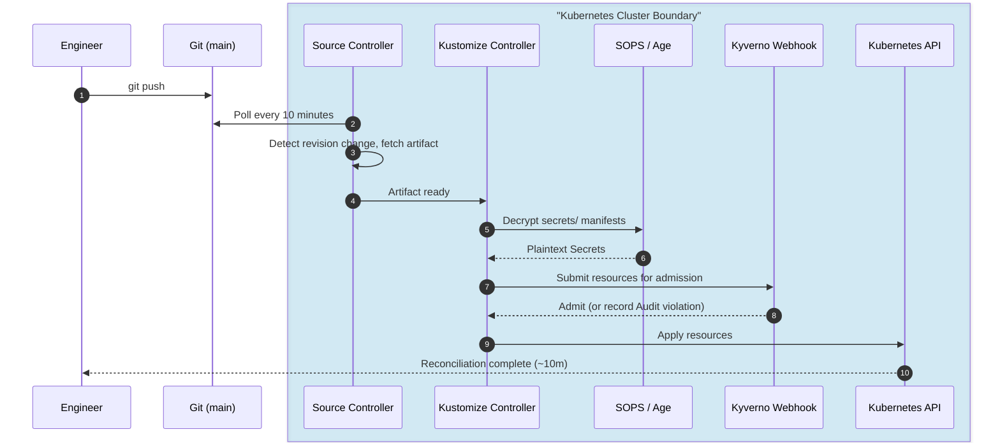
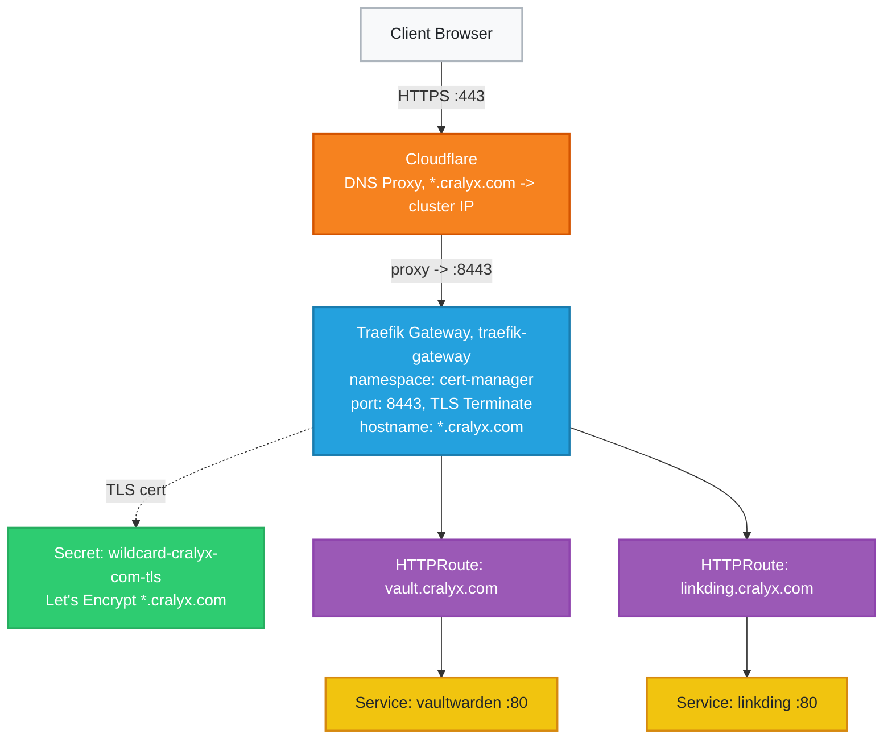
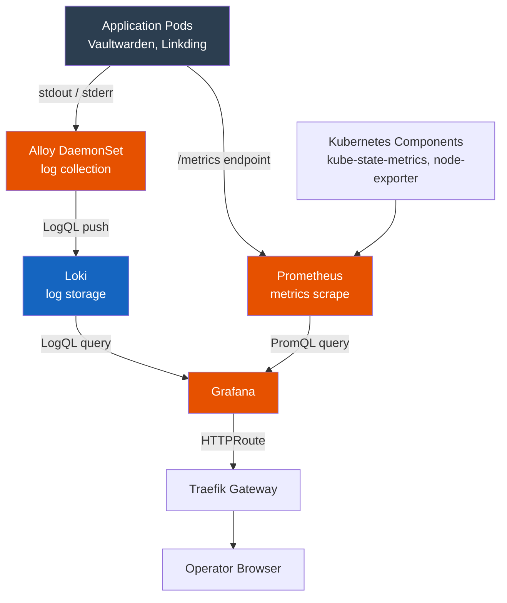
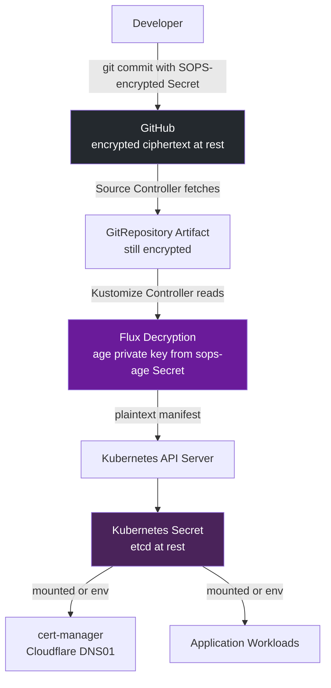

# Cloud-Native Homelab Platform

> A GitOps-managed Kubernetes platform where infrastructure, applications, and policies are defined in Git and continuously reconciled into the cluster.

---
## Table of Contents

- [Executive Summary](#executive-summary)
- [Architecture Overview](#architecture-overview)
- [Component Summary](#component-summary)
- [Repository Structure](#repository-structure)
- [GitOps Workflow](#gitops-workflow)
- [Image Automation](#image-automation)
- [Dependency Updates (Renovate)](#dependency-updates-renovate)
- [Networking Architecture](#networking-architecture)
- [Observability Stack](#observability-stack)
- [Security Architecture](#security-architecture)
- [Architectural Decisions and Tradeoffs](#architectural-decisions-and-tradeoffs)
- [Known Gaps and Honest Assessment](#known-gaps-and-honest-assessment)

---
## Executive Summary

This repo is the single source of truth for my homelab Kubernetes platform. It runs on a single-node k3s cluster on Debian 13, managed entirely by FluxCD. Nothing is applied manually. Namespaces, certificates, deployments, routing rules, secrets, and admission policies are all reconciled from this repo.

The platform hosts two self-hosted apps: **Vaultwarden** at `vault.cralyx.com` and **Linkding** at `linkding.cralyx.com`. Both are served over HTTPS via Traefik's Gateway API implementation, TLS-terminated with a wildcard Let's Encrypt cert issued through Cloudflare DNS-01 challenge.

Updates are handled by two separate pipelines:

- **Flux Image Automation** handles container images (Vaultwarden, Linkding). The cluster scans Docker Hub every hour, checks new tags against semver policies, and commits the updated image reference back to `main`. No human involvement needed.
- **Renovate Bot** handles Helm chart dependencies (cert-manager, Kyverno, Loki, Alloy, kube-prometheus-stack). It runs as a Kubernetes CronJob hourly, opens PRs for outdated charts, and waits at least 48 hours after a release before surfacing it. You review and merge, Flux does the rest.

Secrets are encrypted with SOPS/Age and stored in the repo. Admission policies run through Kyverno. Metrics and logs go through kube-prometheus-stack, Loki, and Grafana Alloy into a single Grafana dashboard.

---
## Architecture Overview

<p align="center">
  
</p>

<p align="center">
  <em>
    High-level architecture showing GitOps reconciliation, security controls,
    networking, observability, and application delivery.
  </em>
</p>

---

## Component Summary

| Component                 | Role                    | Why This Choice                                                                                             |
| ------------------------- | ----------------------- | ----------------------------------------------------------------------------------------------------------- |
| **Debian 13**             | Host OS                 | Stability, long support lifecycle, minimal overhead                                                         |
| **k3s**                   | Kubernetes distribution | Single-binary, production-capable, ships Traefik and CoreDNS; minimal operational overhead                  |
| **FluxCD**                | GitOps engine           | Pull-based reconciliation; image automation built-in; no external CI pipeline required                      |
| **Traefik v3**            | Ingress + Gateway API   | Bundled with k3s; Gateway API support enabled via `HelmChartConfig`; avoids a second ingress controller     |
| **Gateway API**           | Traffic routing         | Supersedes Ingress; clean separation between infrastructure (Gateway) and application (HTTPRoute) ownership |
| **Cloudflare**            | DNS                     | DNS-01 ACME challenge support; wildcard cert issuance without exposing HTTP endpoints publicly              |
| **cert-manager**          | TLS lifecycle           | De facto Kubernetes standard; automatic ACME + Cloudflare integration; handles renewal                      |
| **kube-prometheus-stack** | Metrics + dashboards    | Bundles Prometheus, Grafana, node-exporter, and recording rules in one release                              |
| **Loki**                  | Log aggregation         | Label-indexed; pairs naturally with Kubernetes metadata; native Grafana integration                         |
| **Grafana Alloy**         | Telemetry pipeline      | Unified replacement for Promtail and Grafana Agent; single DaemonSet for logs and metrics                   |
| **Kyverno**               | Admission policies      | Native Kubernetes YAML policies; no Rego required; supports background scanning of existing resources       |
| **Renovate Bot**          | Helm chart updates      | Self-hosted as a Kubernetes CronJob; opens PRs for outdated Helm charts with a configurable stability delay |
| **SOPS + Age**            | Secret encryption       | Asymmetric encryption; Git-compatible diffs; no external secret store dependency                            |
| **Vaultwarden**           | Password manager        | Self-hosted Bitwarden; critical personal infrastructure                                                     |
| **Linkding**              | Bookmark manager        | Lightweight, minimal resource footprint                                                                     |

---

## Repository Structure

```
.
├── apps/                               # Application workloads
│   ├── kustomization.yaml
│   ├── linkding/
│   │   ├── deployment.yaml             # Namespace, Deployment (pinned image + resource limits), Service
│   │   ├── certificate.yaml
│   │   ├── pvc.yaml                    # PVC -> /etc/linkding/data
│   │   └── kustomization.yaml
│   └── vaultwarden/
│       ├── deployment.yaml             # Namespace, Deployment, Service; SIGNUPS_ALLOWED=false
│       ├── certificate.yaml
│       ├── pvc.yaml                    # PVC -> /data
│       └── kustomization.yaml
│
├── clusters/
│   └── production/                     # single cluster entrypoint
│       ├── kustomization.yaml          # root Kustomization that references all layers
│       ├── flux-system/                # Flux bootstrap manifests (gotk-components, gotk-sync)
│       ├── secrets.yaml                # Kustomization CR: ./secrets, SOPS decrypt enabled
│       ├── infrastructure.yaml         # Kustomization CR: ./infrastructure, dependsOn: secrets
│       ├── policies.yaml               # Kustomization CR: ./policies/kyverno, dependsOn: infrastructure
│       └── apps.yaml                   # Kustomization CR: ./apps, dependsOn: infrastructure
│
├── infrastructure/                     # Platform components
│   ├── cert-manager/                   # HelmRelease, ClusterIssuer, wildcard Certificate, namespace
│   ├── flux-image/                     # Image automation: ImageRepository, ImagePolicy, ImageUpdateAutomation
│   │   ├── gitrepository-write.yaml    # Dedicated GitRepository using write SSH deploy key
│   │   ├── imagerepository-*.yaml      # Polls Docker Hub for vaultwarden + linkding tags
│   │   ├── imagepolicy-*.yaml          # Semver filter: 1.x range for both apps
│   │   └── imageupdateautomation.yaml  # Commits updated image tags to main via write key
│   ├── gateway/                        # Gateway: traefik-gateway, *.cralyx.com
│   ├── kyverno/                        # HelmRelease + namespace
│   ├── logging/                        # Loki HelmRelease + Alloy HelmRelease + namespace
│   ├── monitoring/                     # kube-prometheus-stack HelmRelease, Grafana TLS + routing
│   ├── renovate/                       # Renovate Bot: HelmRepository + HelmRelease (CronJob)
│   ├── traefik/                        # HelmChartConfig to enable Gateway API on k3s Traefik
│   └── kustomization.yaml
│
├── policies/
│   └── kyverno/
│       ├── disallow-latest.yaml        # Audit: no :latest image tags
│       ├── require-resources.yaml      # Audit: CPU + memory requests/limits required
│       └── kustomization.yaml
│
├── secrets/
│   ├── cloudflare/
│   │   └── api-token.yaml              # SOPS-encrypted Cloudflare API token
│   ├── renovate/
│   │   ├── namespace.yaml              # renovate namespace (created before infrastructure)
│   │   └── renovate-secret.yaml        # SOPS-encrypted RENOVATE_TOKEN
│   └── kustomization.yaml
│
├── renovate.json                       # Renovate config: explicit repo list, 48h minimumReleaseAge
└── .sops.yaml                          # Scope: secrets/**/*.yaml, fields: data + stringData only
```

---

## GitOps Workflow

### Reconciliation Dependency Chain

Reconciliation order is enforced through `dependsOn` in the cluster-layer Kustomization files. Each layer sets `wait: true`, so Flux health-checks everything before moving on to the next layer.



`wait: true` catches a whole class of race conditions that are annoying to debug. Without it you get things like `ClusterIssuer` being applied before cert-manager CRDs exist, or `HTTPRoute` referencing a Gateway that hasn't come up yet. Both have happened on this cluster.

### Full Reconciliation Sequence



`prune: true` is set on every Kustomization. Anything removed from Git gets deleted from the cluster on the next cycle. No manual cleanup needed.

---
## Image Automation

Flux handles container image updates fully automatically. New versions are discovered, checked against policy, committed to Git, and deployed without any manual steps.

### The Setter Annotation

`ImageUpdateAutomation` uses the `Setters` strategy. It scans the repo for marker comments and rewrites the image tag in place:

```yaml
# apps/vaultwarden/deployment.yaml
image: vaultwarden/server:1.37.1 # {"$imagepolicy": "flux-system:vaultwarden"}

# apps/linkding/deployment.yaml
image: sissbruecker/linkding:1.45.0 # {"$imagepolicy": "flux-system:linkding"}
```

### Policy Scope

| App | Image | Policy range | Auto-deploys | Requires manual review |
|---|---|---|---|---|
| Vaultwarden | `vaultwarden/server` | `1.x` | Any `1.y.z` release | `2.0.0` and above |
| Linkding | `sissbruecker/linkding` | `1.x` | Any `1.y.z` release | `2.0.0` and above |

The `1.x` cap is intentional. Major version bumps can carry breaking schema changes or data migration requirements, so those need a human to read the changelog, update the policy range, and explicitly accept the upgrade.

### Write Deploy Key

`ImageUpdateAutomation` needs write access to Git to commit tag updates back to `main`. There's a dedicated SSH deploy key (`flux-image-automation`) stored as a Kubernetes Secret in `flux-system` and added to GitHub with write access. A separate `GitRepository/flux-system-write` uses this secret, keeping the write credential separate from the read-only `flux-system` GitRepository used for source syncing.

### Relationship to Kyverno's `disallow-latest`

Image automation and the `disallow-latest` policy work well together. Automation keeps all production images on pinned semver tags, which is exactly what the policy enforces. Kyverno acts as a backstop: if someone manually committed a `:latest` tag, it would show up as an audit violation in `PolicyReport` before anything could act on it.

---

## Dependency Updates (Renovate)

Renovate handles Helm chart updates, where it makes sense to have a PR to review before deploying.

### How It Works

Renovate runs as a Kubernetes `CronJob` (deployed via the `renovate/renovate` Helm chart) on an hourly schedule. Each run:

1. Clones `Aishwaryaa12/k3s-flux`
2. Extracts all Flux `HelmRelease` dependencies across `apps/`, `infrastructure/`, and `clusters/`
3. Checks each chart version against the upstream Helm repository
4. Opens a PR for any chart with an available update, but only if the release is at least 48 hours old

The 48-hour `minimumReleaseAge` is there to avoid getting burned by a bad release. If an upstream maintainer pushes and quickly yanks a broken version, Renovate won't surface it.

### Tracked Dependencies

| Chart | Helm Repository | Version Constraint |
|---|---|---|
| `cert-manager` | `jetstack` | `v1.18.*` |
| `kube-prometheus-stack` | `prometheus-community` | `77.*` |
| `kyverno` | `kyverno` | `3.*` |
| `loki` | `grafana` | `6.*` |
| `alloy` | `grafana` | `1.x` |
| `renovate` | `renovatebot` | `*` (latest) |

### Renovate vs Image Automation

| | **Renovate (Helm charts)** | **Flux Image Automation (containers)** |
|--|--|--|
| What it tracks | Helm chart versions | Docker image tags |
| How updates arrive | Pull Request, reviewed and merged | Auto-commit directly to `main` |
| Human gate | Yes | No |
| Stability delay | 48 hours | None |
| Scope | `infrastructure/` HelmReleases | `apps/` deployment image tags |

### Renovate Config

```json
{
  "$schema": "https://docs.renovatebot.com/renovate-schema.json",
  "extends": ["config:recommended"],
  "minimumReleaseAge": "48 hours",
  "flux": {
    "fileMatch": [
      "(?:^|/)apps/.+\\.yaml$",
      "(?:^|/)infrastructure/.+\\.yaml$",
      "(?:^|/)clusters/.+\\.yaml$"
    ]
  }
}
```

The `flux.fileMatch` pattern tells Renovate to scan all YAML files under `apps/`, `infrastructure/`, and `clusters/`, not just the repo root.

---

## Networking Architecture

### Traffic Flow



### Gateway API vs Ingress

The move to Gateway API is mainly about ownership separation, not just a new API. The `Gateway` is owned by the platform (what hostnames are exposed, on what ports, with what TLS). The `HTTPRoute` is owned by the app (how traffic gets to the service). Neither can step on the other.

`allowedRoutes.namespaces.from: All` is fine here since it's a single-operator setup where every namespace is trusted. A multi-team setup would want `from: Selector` with namespace labels instead.

One thing worth calling out: k3s's Traefik maps entrypoints (`web`, `websecure`) to internal ports `8000` and `8443`, not the external ports `80` and `443`. Gateway API listeners have to use the internal entrypoint port. If you put `port: 443` in the listener spec, Traefik's Gateway controller won't match it and listener validation fails. The right setup is `port: 8443` in the Gateway listener with `hostPort: 443` in `HelmChartConfig`. The external and listener ports are intentionally different.

`hostPort` binds Traefik directly to the node's network interface, so there's no need for a `LoadBalancer` Service or MetalLB.

---

## Observability Stack



**Prometheus** (via `kube-prometheus-stack`) scrapes metrics from Flux controllers, Traefik, Kyverno, and node-level metrics via `node-exporter`. Service discovery is handled through `PodMonitor` and `ServiceMonitor` resources.

**Grafana Alloy** runs as a `DaemonSet` and tails container logs from every pod. It enriches each stream with Kubernetes metadata (`namespace`, `pod`, `container`) before shipping to Loki. Those labels become the main dimensions for filtering logs during an incident.

**Loki** stores logs in label-indexed format. It doesn't do full-text indexing, which fits well with how Kubernetes log queries tend to work in practice.

**Grafana** is the single frontend for both Prometheus and Loki. Logging and monitoring are split into separate namespaces (`logging` and `monitoring`) so they can be upgraded independently.

---

## Security Architecture



### Admission Control: Kyverno

**`disallow-latest-tag`** flags any Pod using the `:latest` image tag. Mutable tags make it impossible to know what's actually running, and you can't roll back to a known state. All workloads on this platform use pinned semver tags because image automation enforces it.

**`require-resource-requests-limits`** flags any Pod missing CPU or memory `requests` and `limits`. On a single-node cluster, one runaway container can take down everything else.

Both policies use `validationFailureAction: Audit` with `background: true`. Audit mode logs violations in `PolicyReport` without blocking anything, which is the right starting point while third-party Helm charts are still being checked for compliance. `background: true` keeps re-evaluating existing resources in the background.

```bash
# Check policy compliance across all namespaces
kubectl get policyreport -A
kubectl describe clusterpolicyreport
```

### TLS and Application Security

All public endpoints are HTTPS only. Nothing is exposed over plain HTTP. The wildcard cert is issued and renewed automatically by cert-manager. Vaultwarden has `SIGNUPS_ALLOWED=false` so the instance doesn't accept any new registrations.

---
## Architectural Decisions and Tradeoffs

| Architectural Decision | Rationale | Accepted Tradeoff |
| --- | --- | --- |
| k3s Built-in Traefik via `HelmChartConfig` | Avoids ownership conflicts with k3s's internal Helm controller. Fewer controllers overall. | Upgrades are tied to k3s releases. Uses a blunt `reinstall` failure policy instead of graceful rollback. |
| Wildcard Certificate (`*.cralyx.com`) | Adding a new subdomain only needs an `HTTPRoute`. Avoids ACME rate limits and keeps secret management simple. | Shared blast radius if the cert is compromised. Gateway has to live in the same namespace as the TLS secret, or you need a `ReferenceGrant`. |
| SOPS/Age over External Secrets Operator | Fully self-contained. No external runtime dependencies. Secret history is auditable in Git. | Key rotation means re-encrypting everything. No per-access audit log like you'd get with Vault. |
| Two-track update pipeline (Renovate + Image Automation) | Helm chart updates go through a PR with a 48-hour stability delay. Container image updates are fully automated within bounded semver policies. Each track matches the risk level of what it manages. | Container images deploy without review. A compromised upstream image within `1.x` would auto-deploy. Helm PRs need someone available to review and merge. |
| Kyverno Policies in `Audit` Mode | Prevents `Enforce` from blocking third-party Helm charts during bootstrap. | Non-compliant pods can run. Requires actively reviewing `PolicyReport` and flipping to `Enforce` when ready. |

---
## Current Limitations and Next Steps

| Gap | Planned Resolution |
|------|------|
| Kyverno policies in `Audit`, not `Enforce` | Audit chart defaults and gradually flip to `Enforce` once everything is compliant |
| `allowedRoutes.namespaces.from: All` | Switch to namespace selectors if additional teams or untrusted namespaces get added |
| Image automation commits directly to `main` | Add Cosign verification and possibly a PR-based workflow for higher-risk workloads |
| Single-node cluster | Add nodes and move to an HA control plane when uptime becomes a harder requirement |
| No image signature verification | Implement Cosign and Kyverno `verifyImages` policies |
| No PVC backup strategy | Set up Velero with an S3-compatible backend |
| Renovate only covers `Aishwaryaa12/k3s-flux` | Extend `repositories` list or enable `autodiscover` when more repos get added |
