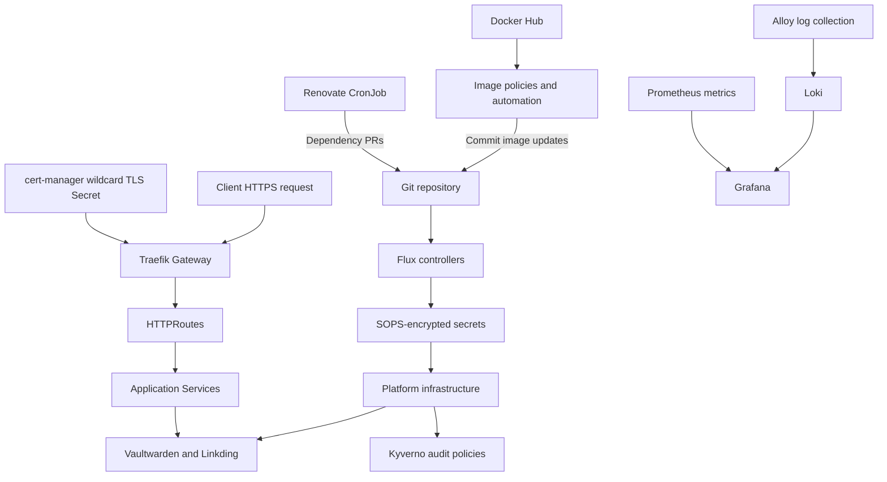

# Kubernetes Homelab with Flux GitOps

A Kubernetes platform for hosting Vaultwarden and Linkding, with declarative application delivery, encrypted secrets, automated image updates, and shared HTTPS routing.

The project brings together the operational concerns of running persistent personal services: deployment consistency, certificate renewal, dependency updates, resource controls, and observability. It targets a single-node k3s homelab on Debian 13. This repository manages Kubernetes configuration; host provisioning and initial credentials are separate bootstrap steps.

## Project highlights

- **GitOps delivery:** Flux reconciles application, infrastructure, secret, and policy configuration from Git.
- **Automated updates:** Flux Image Automation tracks application images within a `1.x` version range. Renovate proposes Helm dependency updates.
- **Secret management:** SOPS and Age encrypt Cloudflare and Renovate credentials before they are committed.
- **Shared HTTPS routing:** Traefik implements Gateway API routes with a wildcard certificate requested through cert-manager and Cloudflare DNS-01.
- **Observability:** kube-prometheus-stack provides the metrics platform, while Grafana Alloy collects Kubernetes logs for Loki.
- **Policy visibility:** Kyverno audits image tags and CPU/memory requests and limits.

## Architecture


```mermaid
flowchart TD
    Git[Git repository] --> Flux[Flux controllers]
    Flux --> Secrets[SOPS-encrypted secrets]
    Secrets --> Infra[Platform infrastructure]
    Infra --> Apps[Vaultwarden and Linkding]
    Infra --> Policies[Kyverno audit policies]

    Registry[Docker Hub] --> Images[Image policies and automation]
    Images -->|Commit image updates| Git
    Renovate[Renovate CronJob] -->|Dependency PRs| Git

    Client[Client HTTPS request] --> Traefik[Traefik Gateway]
    Cert[cert-manager wildcard TLS Secret] --> Traefik
    Traefik --> Routes[HTTPRoutes]
    Routes --> Services[Application Services]
    Services --> Apps

    Alloy[Alloy log collection] --> Loki[Loki]
    Loki --> Grafana[Grafana]
    Prometheus[Prometheus metrics] --> Grafana
```

### Application traffic

| Hostname | Route destination | Container port | Persistent data |
|---|---|---|---|
| `vault.cralyx.com` | `vaultwarden` Service, port 80 | 80 | 5Gi claim mounted at `/data` |
| `linkding.cralyx.com` | `linkding` Service, port 80 | 9090 | 2Gi claim mounted at `/etc/linkding/data` |
| `grafana.cralyx.com` | Grafana Service, port 80 | Chart-managed | 5Gi local-path storage configured |

Traefik binds host ports 80 and 443. The HTTPS Gateway listener uses its internal port 8443 and references a TLS Secret in `cert-manager`. HTTPRoutes attach from the application namespaces and select their local Services.

The certificate requests `*.cralyx.com` and `cralyx.com`. Public DNS records, Cloudflare proxy settings, and any router forwarding are configured outside this repository.

## How delivery works

The [cluster entrypoint](clusters/production/kustomization.yaml) declares four Flux reconciliation layers:

```text
secrets → infrastructure → apps
                        → policies
```

The source controller polls Git every minute. The layer Kustomizations reconcile every ten minutes, with pruning enabled. The dependent layers use readiness checks before proceeding.

Application image updates follow a separate loop:

1. ImageRepository resources scan Docker Hub hourly.
2. ImagePolicy resources select matching `1.x` tags.
3. ImageUpdateAutomation updates marked image references and commits to `main` using a dedicated write credential.
4. Flux applies the changed Deployments.

Renovate runs hourly at minute 30 and uses a 48-hour minimum release age for dependency PRs. Some HelmRelease versions use ranges, so Flux can also resolve newer chart versions within those ranges without a new PR. The Renovate delay is not a gate for every chart upgrade.

The configured Flux source is `Aishwaryaa12/flux-gitops`; Renovate targets `Aishwaryaa12/k3s-flux`. These names need to resolve to the intended repository when reproducing the setup.

## Implementation choices

| Choice | Purpose | Trade-off |
|---|---|---|
| k3s with bundled Traefik | Keep the homelab platform compact | Host availability and bundled component lifecycle matter |
| Flux Kustomizations and HelmReleases | Keep desired state and ownership in Git | Bootstrap dependencies still need explicit ordering |
| Gateway API | Separate shared listeners from application routing | Route attachment permissions need review as tenancy grows |
| SOPS/Age | Store encrypted secret values alongside configuration | Private-key backup and rotation remain operator responsibilities |
| Automated application image commits | Reduce routine update work | Stateful upgrades need recovery planning even within a major version |
| Kyverno Audit mode | Report violations without blocking workloads | Noncompliant Pods can still run |
| Local persistent storage | Keep storage simple for a small environment | Node loss and data recovery remain significant risks |

## Monitoring and security

Loki is configured as a single instance with filesystem storage, a 10Gi local-path volume, and seven-day retention. Alloy runs as a DaemonSet and reads Pod logs through the Kubernetes API. Grafana has a Loki datasource alongside the metrics stack.

Vaultwarden disables new signups. Both applications define CPU and memory requests and limits. Secret values are encrypted in Git and decrypted by Flux into Kubernetes Secrets at reconciliation time. Runtime Secret access still depends on Kubernetes permissions and cluster security.

## Repository guide

| Path | Contents |
|---|---|
| [`clusters/production/`](clusters/production/) | Flux bootstrap, source synchronization, and reconciliation layers |
| [`apps/`](apps/) | Application namespaces, Deployments, Services, and PVCs |
| [`infrastructure/`](infrastructure/) | Traefik, Gateway routes, certificates, Helm releases, telemetry, and update automation |
| [`policies/kyverno/`](policies/kyverno/) | Audit policies for image tags and resource settings |
| [`secrets/`](secrets/) | SOPS-encrypted credentials and secret-layer resources |
| [`.sops.yaml`](.sops.yaml) | Encryption scope and Age recipient |
| [`renovate.json`](renovate.json) | Dependency update configuration |

The active Flux installation is referenced by `clusters/production/flux-system/kustomization.yaml`. The root-level `image-controllers.yaml` and bootstrap `.bak` file are historical artifacts outside that reconciliation path.

## Current scope and next steps

This is a single-node homelab platform with useful automation and explicit operational limits:

- **Bootstrap:** Git credentials, the Age identity, and the image-automation write key must be provisioned separately. Namespace dependencies need restructuring for a clean rebuild: the secret layer needs `cert-manager`, while infrastructure routes need application namespaces created downstream.
- **Recovery and health:** Application backups, restore tests, and explicit readiness/liveness probes are not configured. Persistent volumes alone do not provide a recovery strategy.
- **Security:** App policies are in Audit mode. Application NetworkPolicies and image signature verification are not configured. Gateway attachment currently allows all namespaces.
- **Routing:** An HTTPS redirect Middleware exists but is not attached in the checked configuration.
- **Observability:** Additional application/controller scrape targets, notification delivery, and log-label behavior need explicit validation. Multi-node expansion would also require reviewing Alloy collection scope and storage design.

These are the next steps toward a more resilient platform while preserving a manageable footprint for personal hosting.
